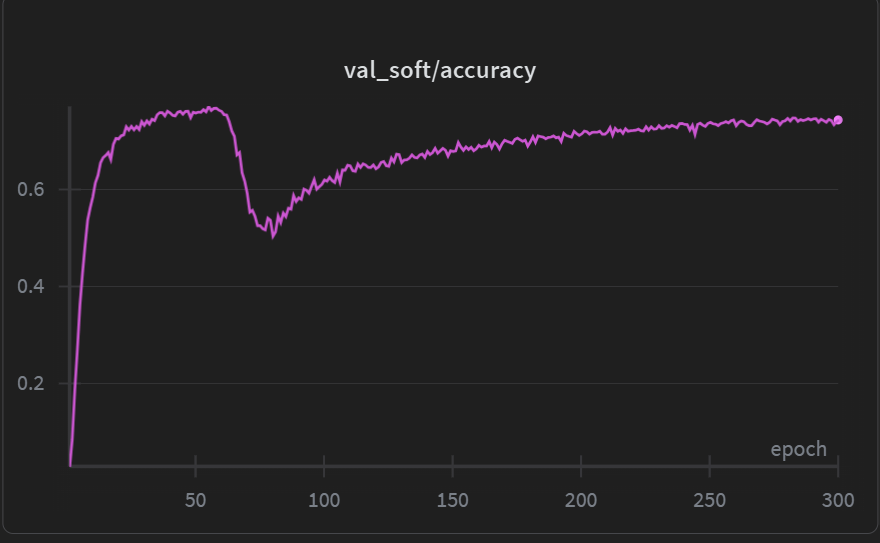

# binary_resnet18

In this repository we provide the code to gradually binarize the weights of a Resnet18 pretrained
on Imagenet. For our experiments, we finetune on CIFAR100.

## Methodology 

We only binarize the weights of the Linear and Conv2d layers, containing almost all the weights
of the model. We also gradually quantize to 8 bits the inputs to those layers.
This setup allows for potential great optimizations, even on weak hardware like MCUs: a GEMM between 
int8 activations and binary weights is mainly reduced to sequence of simple int8 add/sub instructions.

The gradual quantization/binarization is done by scheduling a `bin_ratio` param from 0 to 1, 
and using it to interpolate  the full precision and binarized weights. 
We also schedule a `p` param from 0 to 1: each entry of a weight has probability `p` of being binarized 
(we are "sprinkling" the weight tensors with binarized values).
This means that at the start of training the weights are in full precision, and at the end they are fully binary.

The weight binarization is simulated (the weights are still in full precision, but constrained to two values, -1 and +1);
same thing for the activation quantization (which are constrained to the int8 range of values).

The stem of the Resnet18 (7x7 conv with stride 2, followed by 2x2 pooling) is replaced with a simple
3x3 conv with stride 1. This is done to remove the 4x initial downsampling needed for Imagenet, but not for CIFAR100.

## Results
By running the `train.py` script with the current settings of `config.py`:
- we reach a baseline (no binarization/quantization) of 76.7% eval accuracy on cifar100 over 60 epochs
- then we binarize gradually, retaining a 74.3% eval accuracy 240 additional epochs.



## Reproducibility 
Running the training script requires python3 and having a wandb account for logging.

Install python requirements:
```
pip install -r requirements.txt
```

Then run the following command to login to your wandb accout (for logging):
```
wandb login
```

Then run the experiment:
```
python3 src/train.py
```
